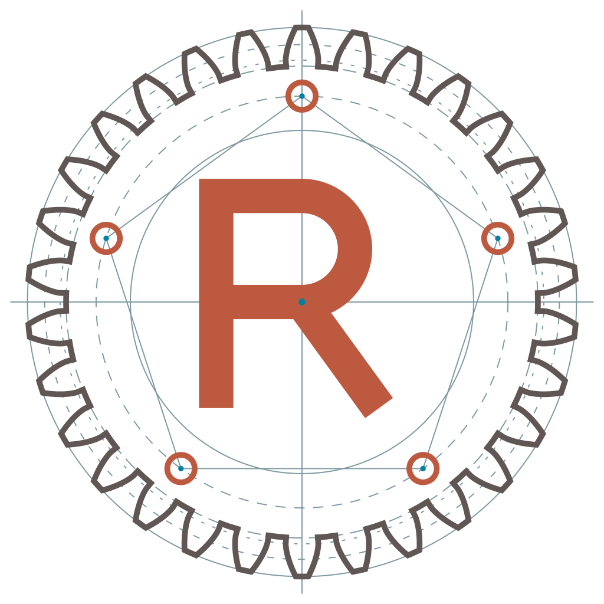

<picture>
  <source media="(prefers-color-scheme: dark)" srcset="assets/logo/rings-white.svg">
  
</picture>

# Rings Network

[](https://github.com/RingsNetwork/rings/actions/workflows/auto-release.yml)
[](https://crates.io/crates/rings-node)
[](https://docs.rs/rings-node/latest/rings_node/)

[](https://github.com/sponsors/RingsNetwork)

**A peer-to-peer network for the sovereign age.**

Rings is a structured peer-to-peer network that runs in the browser. A browser tab or a
native daemon joins the same Chord DHT overlay, is addressed by a DID, and talks to other
peers over direct WebRTC datachannels, with no application server in the data path.

## Why Rings

- **A browser tab is a full peer.** The node compiled to WebAssembly joins the DHT, routes
  and stores for other peers, and connects browser to browser, without a light-client mode
  or a gateway between it and the network.
- **A privacy layer ships with the overlay.** Onion circuits with layered ElGamal-AEAD,
  fixed-batch cover cells, pacing, and persisted entry guards run on native nodes and in
  the browser: the [hosted console](https://rings.rs/#node) sends HTTPS requests and
  browses sites through circuits from a tab.
- **One overlay for many key systems.** Peers sign with secp256k1 (including MetaMask's
  EIP-191), ed25519 (including Phantom), WebCrypto P-256, or bip137, and every signature is
  bound to its overlay and message family.
- **Protocols are pure state machines.** An application registers a namespace, writes a
  pure `step` function, and performs IO in an interpreter shell that can only act in its
  own namespace.
- **Built for hostile input.** Every message is signed by its origin, verified before
  dispatch, delivered at most once through a persisted replay window, and rate-limited per
  origin account at its destination. Connection, storage, and queue state is bounded. CI
  model-checks Chord rejoin races, runs Miri on core invariants and ASan/LSan on the FFI,
  feeds every wire decoder generated malformed input, and replays ring scenarios
  deterministically; production code denies `unwrap`, `expect`, and `panic`.

## Try it

- **In the browser, nothing to install:** open [rings.rs/#node](https://rings.rs/#node),
  pick an account, start the node, and connect through the public seed `node.rings.rs`.
- **Native daemon:** download `rings` for macOS or Linux from
  [Releases](https://github.com/RingsNetwork/rings/releases), then `rings init` and
  `rings run`. Other ways to install are under [Installation](#installation).
- **In your web app:** `npm install @ringsnetwork/rings-node`; the
  [guide](https://rings.rs/#guide) has the first commands for every runtime.

## Project status

Rings is pre-1.0, and a public overlay runs behind the seed `node.rings.rs`.
Before 1.0 the wire protocol is not versioned: a release that changes it is marked in the
[CHANGELOG](./CHANGELOG.md) as a network-wide upgrade. 1.0 freezes the protocol once
connectivity and churn handling are stable; the DRanking ranking protocol ships as 2.0.
See [ROADMAP.md](./ROADMAP.md).

[SECURITY.md](./SECURITY.md) states what each layer guarantees and where it stops. In
short: the overlay authenticates every peer and message and, after an E2E handshake,
encrypts payloads; hiding who talks to whom is the privacy layer's job; and making
identities scarce for open public membership is planned work
([#780](https://github.com/RingsNetwork/rings/issues/780)), so public deployments add
their own admission policy today.

## Where Rings fits

✅ supported · ❌ not provided. Qualifications are listed below the table.

| Network | Browser P2P | Structured P2P | Privacy layer | E2E encryption |
|---|:---:|:---:|:---:|:---:|
| **Rings** | ✅ | ✅ Chord | ✅ Separate layer | ✅¹ |
| **libp2p** | ✅ | ✅ Kademlia² | ❌ | ✅³ |
| **aMule / Kad** | ❌ | ✅ Kademlia | ❌ | ❌⁴ |
| **Nostr** | ❌ | ❌ | ❌ | ✅⁵ |
| **Nym mixnet** | ❌ | ❌ | ✅ Full mixnet path | ✅⁶ |
| **Tor** | ❌ | ❌ Relay network | ✅ Onion circuits | ✅⁷ |
| **I2P** | ❌ | ✅ netDb² | ✅ Tunnel network | ✅⁶ |
| **WebTorrent (browser)** | ✅ | ❌ | ❌ | ✅³ |

Browser P2P means the browser itself connects as a peer; a browser UI or gateway
client does not qualify. Structured P2P includes DHT-based discovery; it does not
imply that application traffic is routed through the DHT. Privacy means network
metadata protection, separate from payload encryption.

1. Rings E2E streams require the E2E handshake; plain overlay messages are not E2E-encrypted.
2. libp2p offers an optional Kademlia DHT. I2P uses a Kademlia-based netDb for discovery; messages travel through tunnels.
3. Encrypted peer connections: libp2p includes circuit-relayed connections; browser WebTorrent uses WebRTC/DTLS. This does not make published content private or add E2E to pubsub forwarding.
4. aMule protocol obfuscation is not a secure E2E guarantee. This row covers Kad; eD2k uses indexing servers.
5. Nostr supports encrypted messages, such as NIP-44 payloads; public events are not encrypted.
6. Between Nym clients or I2P destinations. Traffic beyond an exit/outproxy needs application encryption.
7. Tor provides E2E for onion services; ordinary websites need HTTPS beyond the exit. A privacy layer is not an unconditional anonymity guarantee.

[Primary sources](./docs/src/README.md#primary-sources) ·
[Rings security model](./SECURITY.md#layer-contracts)

## Reading paths

- **Run a peer:** [Installation](#installation), then [node operations](./docs/src/cli.md).
- **Build an application:** [Examples](#examples) and [Extending Rings](#extending-rings).
- **Evaluate the design:** [Protocol comparison](#where-rings-fits), [Architecture](#architecture), and [Security model](./SECURITY.md).
- **Read the research:** [Papers and build instructions](./papers/README.md), including DRanking and finger convergence.

## Whitepaper

The canonical protocol paper is maintained in this repository:

- [Rings whitepaper PDF](./papers/rings.pdf)
- [LaTeX source](./papers/rings.tex)
- [Paper assets and build notes](./papers/README.md)
- [DRanking paper](./papers/dranking.pdf): the verifiable ranking protocol planned for 2.0;
  the [provisional service receipts](./docs/src/advanced-topic/dranking-service-receipts.md)
  shipped today collect its evidence and do not affect routing or credit.
- [Finger-convergence specification](./papers/finger-convergence.pdf): range-proved
  finger convergence and its assumptions.

If you cite Rings in academic or technical writing, use:

```bibtex
@misc{rings-network,
  author = {Ryan J. Kung},
  title = {Rings: A peer-to-peer network for sovereign age},
  year = {2023},
  month = feb,
  url = {https://github.com/RingsNetwork/rings/blob/master/papers/rings.pdf},
  note = {Repository-owned whitepaper and LaTeX source: https://github.com/RingsNetwork/rings/tree/master/papers}
}
```

## Features

### Browser-native peers

Rings runs in browsers through WebAssembly and `web_sys`, and on native hosts through
the same Rust node stack. WebRTC datachannels carry peer-to-peer traffic, including
browser-to-browser connections without an application server in the data path.

### DID identity and cryptography

Peers are addressed by decentralized identifiers backed by selectable signature
schemes, including secp256k1, secp256r1, ed25519, BLS, and bip137. This lets Rings
bridge browser, daemon, and wallet-oriented identity workflows without binding the
network to one key system.

### Structured peer routing

The overlay uses a Chord DHT for successor/finger-table routing, DID lookup, message
relay, stabilization, and `network_id` isolation. Independent overlays stay separate
while retaining deterministic, loop-free routing.

### Privacy layer

Onion circuits in [`crates/node/src/onion`](./crates/node/src/onion) carry traffic over
direct edges through layered ElGamal-AEAD frames, fixed-batch cover cells with pacing,
and fixed cell size classes. A circuit hides the route's hops from one another and hides
the client from the exit. It does not hide the client from its first hop, does not hide
overlay membership, and does not hide activity timing from an observer that watches
every link. The plain overlay relay offers none of this: it minimizes what it leaks, and
the privacy layer is where privacy is provided. See
[the layer contracts](./SECURITY.md#layer-contracts).

### Protocol runtime

Application protocols are namespace-scoped. A protocol's `step` function stays pure,
and all side effects are performed by its `Interpret` shell through a scoped capability.
That keeps protocol logic extensible without adding a global effect bus to the core.

## Installation

The browser node needs no installation: open [rings.rs/#node](https://rings.rs/#node).
For the `rings` CLI, use a prebuilt release, Cargo, or a source checkout.

### Prebuilt binaries

Every [release](https://github.com/RingsNetwork/rings/releases) ships `rings` for macOS
(`aarch64`, `x86_64`) and Linux (`x86_64` musl, static), plus the WebAssembly package.

### From Cargo

The workspace denies compiler warnings, so build with the Rust release pinned in
[`rust-toolchain.toml`](./rust-toolchain.toml); a newer compiler can add a warning that
fails the build:

```sh
cargo +1.97.0 install --locked rings-node
```

### From source

Install the CLI from a local checkout:

```sh
git clone git@github.com:RingsNetwork/rings.git
cd ./rings
cargo install --path crates/node
```

### Build for WebAssembly

Build the browser provider with Cargo and `wasm-bindgen`:

```sh
cargo build -p rings-node --release --target wasm32-unknown-unknown --no-default-features --features browser
wasm-bindgen --out-dir pkg --target web ./target/wasm32-unknown-unknown/release/rings_node.wasm
```

Or build with `wasm-pack`:

```sh
wasm-pack build --scope ringsnetwork -t web crates/node --no-default-features --features browser,console_error_panic_hook
```

## Usage

```sh
rings --help
```

## Frontend

The browser and extension frontend lives in [`frontend`](./frontend). It is the
user-facing Rings web surface for the landing page, the [guide](https://rings.rs/#guide),
the browser node console, onion proxy WorkBench, wallet login, SDP/HTTP connectivity,
topology, and custom messages.

## Examples

Runnable examples live in [`examples/`](./examples):

| Example | What it shows |
|---|---|
| [`native`](./examples/native) | A minimal native node registering a custom namespaced protocol |
| [`relay`](./examples/relay) | TCP & UDP tunnels to a peer's service over the overlay (`tcp.rs` / `udp.rs`) |
| [`dweb`](./examples/dweb) | A decentralized-web app (Yew / Trunk) |
| [`ffi`](./examples/ffi) | Driving a node over the C FFI |

## Extending Rings

A protocol is a **pure** state machine; all IO lives in its interpreter shell, which can only
act within its own namespace. Inbound overlay messages are routed to a protocol by namespace.

```rust
// Register a pure Protocol + its Interpret shell, then route inbound envelopes to it.
provider.register_protocol(Echo, EchoShell)?;
provider.set_backend()?;

// Built-in relay: tunnel a local socket to a peer's service over the overlay — no server.
let relay = RelayHandle::install(&provider.extensions())?;
relay.register_tcp_service("web".into(), "example.com:80".parse()?).await?; // server side
relay.open_tcp_tunnel(local_addr, peer_did, "web".into()).await?;          // client side
```

In the browser a protocol can be a JS handler instead: `provider.on(namespace, initialState,
handler)`. See [`examples/relay`](./examples/relay) and
[`crates/node/src/extension`](./crates/node/src/extension).

Proof systems use the same user-owned protocol boundary: register a private namespace, encode
versioned proof requests and results as application payloads, and perform proving or verification
in the protocol interpreter. Rings authenticates and routes the envelope but does not select,
execute, or maintain a proving backend.

## Resources

| Resource | Link | Notes |
|---|---|---|
| Rings Whitepaper | [PDF](./papers/rings.pdf), [LaTeX source](./papers/rings.tex), [citation](#whitepaper) | Canonical protocol paper |
| Security model | [SECURITY.md](./SECURITY.md) | Vulnerability reporting, threat model, the communication-layer / privacy-layer contracts, and each subsystem's guarantees |
| Browser frontend | [`frontend`](./frontend) | Landing guide, web app, and extension workflow |
| Documentation | [rings.rs/docs](https://rings.rs/docs/), [source](./docs) | mdBook book, published with the site |
| Guide | [rings.rs/#guide](https://rings.rs/#guide) | One card per runtime with the first commands; the book is the reference |
| For AI agents | [rings.rs/llms.txt](https://rings.rs/llms.txt), [source](./llms.txt) | Project map for coding agents ([llms.txt](https://llmstxt.org/)), maintained with the code |
| Examples | [`examples/`](./examples) | Native, dweb, relay, and FFI examples |
| X (Twitter) | [@RingsNetworkio](https://x.com/RingsNetworkio) | Project announcements |

## Components

* core: DHT, swarm, DID routing, messages, replay and quota admission, and cryptographic identity primitives.

* node: Native daemon, browser/WASM provider, extension runtime, built-in protocols, the onion privacy layer, and the FFI provider.

* transport: Native WebRTC transport and `web_sys`-based browser transport.

* rpc: Rings RPC shared types and the JSON-RPC client/handlers (over HTTP).

* measure: Local peer credit and reliability.

* gateway: Native TUN gateway that carries selected TCP destinations over onion circuits.

* webview: Onion-backed WebView gateway primitives.

* network-policy: Public-network admission policy for egress targets.

* codec, derive: The serde wire codec, and Rings macros including `wasm_export`.

## Architecture

Rings separates peer connectivity, overlay routing, privacy circuits, and application
protocols. Direct WebRTC connections can carry traffic without an application server;
bootstrap, signaling, and ICE infrastructure still matter, and a selected TURN relay
carries transport traffic. Each layer maps to a crate or module:

```text
┌──────────────────────────────────────────────────────────────────────┐
│  Applications   dWeb · relay/tunnel · your own app                     │
├──────────────────────────────────────────────────────────────────────┤
│  Protocols      built-ins: relay (tcp/udp tunnels), echo —             │  node::extension::protocols
│  (namespaced)   plus any user Protocol, addressed by namespace         │
├──────────────────────────────────────────────────────────────────────┤
│  Extension      pure `Protocol::step` → `Effect` → `Interpret` shell   │  node::extension::ext
│  runtime        over a namespace-scoped `Scope` (send / self-inject)   │
├──────────────────────────────────────────────────────────────────────┤
│  Privacy        onion circuits: layered ElGamal-AEAD over direct       │  crates/node/src/onion
│  (circuits)     edges, fixed-batch cover + pacing, exit registry       │
├──────────────────────────────────────────────────────────────────────┤
│  Overlay        Chord DHT: successor / finger tables, stabilization,   │  crates/core
│  (routing +     DID addressing, message relay, network_id isolation,   │
│  encryption)    E2E ElGamal to a DID after its handshake               │
├──────────────────────────────────────────────────────────────────────┤
│  Transport      direct WebRTC datachannels (native + browser/web_sys), │  crates/transport
│                 STUN / ICE / SDP NAT traversal                         │
├──────────────────────────────────────────────────────────────────────┤
│  Identity       DID + secp256k1 / secp256r1 / ed25519 / BLS / bip137   │  crates/core::ecc
└──────────────────────────────────────────────────────────────────────┘
```

- **Transport** establishes direct, peer-to-peer WebRTC datachannels — browser-to-browser
  included — using STUN/ICE/SDP for NAT traversal. Direct connectivity depends on the
  network; when a configured TURN relay is selected, that relay carries the data.
  Native nodes deployed behind cloud firewalls can bound ICE UDP gathering with
  `external_ip`, `webrtc_udp_port_min`, and `webrtc_udp_port_max`; for example,
  `49160..=49200` maps to an AWS security-group rule for `UDP 49160-49200`.
  Browser nodes still use the browser ICE stack, whose local UDP ports are not
  controlled by Rings.
- **Overlay** organizes peers into a Chord DHT and routes messages by DID; distinct overlays are
  isolated by `network_id`. Its contract is routing and confidentiality only: a payload can be
  encrypted to the destination's account key once the E2E handshake has supplied that key, but
  every hop sees the origin DID by signature and the destination DID by routing. The overlay
  minimizes what it leaks; it does not provide privacy.
- **Privacy** is the onion circuit data plane: layered ElGamal-AEAD frames over direct edges,
  fixed-batch cover cells with pacing, fixed cell size classes, and route selection from the
  onion-relay and onion-exit registries. Each relay learns its predecessor and its successor and
  nothing else about the route. See [SECURITY.md](./SECURITY.md#layer-contracts).
- **Extension runtime** is a *functional core / imperative shell*: a protocol's state transition
  is pure (`step`), and all IO happens in its `Interpret` shell, which only ever receives a
  **namespace-scoped capability** (`Scope`). The core owns no global effect/command bus — adding
  a protocol never touches it, and a protocol cannot reach another namespace.
- **Protocols** are addressed by namespace. Built-ins include a **relay** that tunnels local
  TCP/UDP sockets to a peer's service across the overlay (server-less tunneling / peer exit), and
  an echo protocol used by examples and tests. Register your own with
  `provider.register_protocol(..)` (Rust) or `provider.on(namespace, ..)` (JS).

Both the network layer and the privacy layer are shipped; [ROADMAP.md](./ROADMAP.md) tracks the
work toward 1.0 and the fully server-less network beyond it.

## Contributing

Contributions are welcome. [CONTRIBUTING.md](./CONTRIBUTING.md) covers the development setup,
the checks CI runs, and how to report a vulnerability privately.

## License

Rings is released under the GNU Affero General Public License, version 3.0 only
([AGPL-3.0-only](./LICENSE)). Works derived from it must be released under the same license,
and the AGPL's network clause extends that obligation to services that offer Rings over a
network: a product or hosted service built on Rings must publish its source.

A commercial license for use outside the AGPL's terms is available from Rings Network on
request. The Rings Network name, logo, and the hosted [rings.rs](https://rings.rs) service are
not covered by the software license.


## Standards and references

- [ICE: RFC 8445](https://www.rfc-editor.org/rfc/rfc8445) (obsoletes RFC 5245).
- [WebRTC IP address handling: RFC 8828](https://www.rfc-editor.org/rfc/rfc8828).
- [WebRTC data channels: RFC 8831](https://www.rfc-editor.org/rfc/rfc8831).
- [Data Channel Establishment Protocol: RFC 8832](https://www.rfc-editor.org/rfc/rfc8832).
- [Protocol comparison primary sources](./docs/src/README.md#primary-sources).
