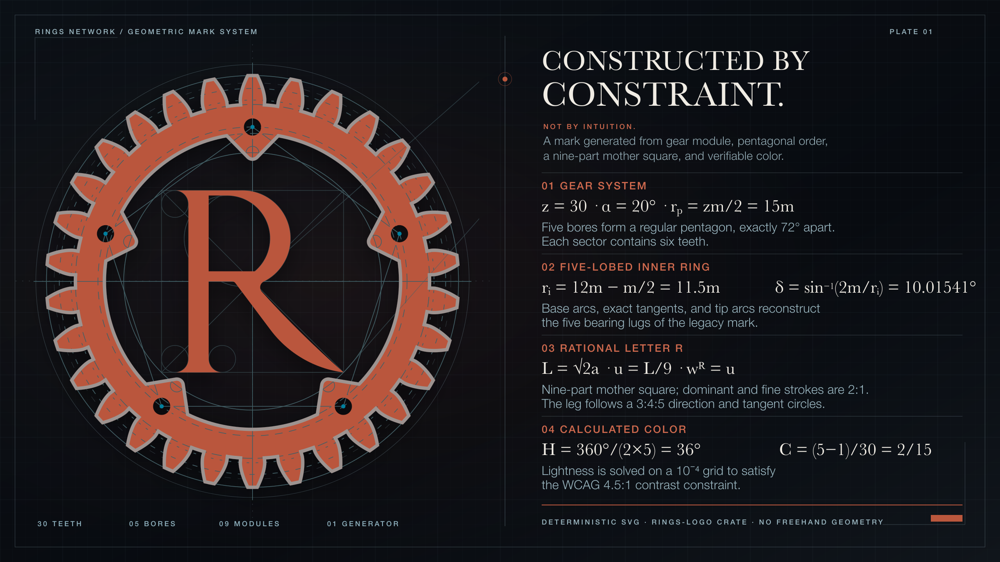

# Rings logo generator



`rings-logo` is the dependency-free Rust crate that generates the canonical
Rings Network mark. The logo is constructed from a small set of mathematical
constraints rather than fitted by eye: the crate derives every contour,
stroke, construction guide, and palette value, then emits the repository's
SVG and JSON assets deterministically.

## Construction

- **Gear:** one module, `m = 10`, determines every length. The gear has 30
  involute teeth at a 20-degree pressure angle.
- **Five-fold order:** five bores lie on a regular pentagon. Adjacent axes are
  exactly 72 degrees apart, and every sector contains six teeth.
- **Inner ring:** five line-arc-line bearing lugs alternate with five circular
  arcs. Their endpoints, tip circles, and connecting tangents are solved from
  the module and bore geometry.
- **Letter R:** a Luca Pacioli-inspired serif R is built from a mother square
  divided into nine modules. Its dominant and fine strokes have a 2:1 ratio;
  the leg follows a rational 3:4:5 direction and tangent-circle constraints.
- **Stroke hierarchy:** the R, mechanical outline, and construction guides
  follow the ratio `30:5:1`.
- **Color:** the rust hue is `360 / (2 * 5) = 36deg`, and chroma is
  `(5 - 1) / 30 = 2/15`. Lightness is solved on a `1/10000` OKLCH grid
  against explicit WCAG contrast targets for light and dark backgrounds.

The historical evidence and the deterministic choices needed to complete the
under-specified letterform are kept separate. The latter are named the
**Rings completion** and recorded, with their solved coordinates, in
[`rings-spec.json`](../../assets/logo/rings-spec.json).

The full construction notes are in
[`assets/logo/README.md`](../../assets/logo/README.md).

## Usage

Run these commands from anywhere inside the repository:

```sh
cargo run -p rings-logo -- generate
cargo run -p rings-logo -- check
```

- `generate` reconstructs all canonical logo assets from the Rust model.
- `check` fails when a checked-in asset differs from the generator output.

The generated files are repository artifacts, not design sources. Do not edit
them by hand.

## Generated assets

| Asset | Purpose |
| --- | --- |
| `assets/logo/rings.svg` | Light-background mark |
| `assets/logo/rings-white.svg` | Dark-background mark |
| `assets/logo/rings-spec.json` | Inputs, formulas, solved geometry, and palette measurements |
| `frontend/assets/icons/rings.svg` | Frontend mark |
| `frontend/assets/icons/favicon.svg` | Adaptive frontend favicon |
| `frontend/assets/social/card.svg` | Social sharing card |
| `docs/src/assets/rings.svg` | Documentation mark |
| `docs/theme/favicon.svg` | Adaptive documentation favicon |

## Implementation

- [`model.rs`](src/model.rs) derives the gear, pentagonal bore system, and
  five-lobed inner profile.
- [`glyph.rs`](src/glyph.rs) constructs the central R and its tangencies.
- [`color.rs`](src/color.rs) solves and verifies the light and dark palettes.
- [`svg.rs`](src/svg.rs) renders the shared geometry into deterministic SVG
  and JSON outputs.
- [`generated_assets.rs`](tests/generated_assets.rs) verifies that the
  checked-in assets match the generator byte for byte.

## Attribution

The gear motif originates in the Rust logo artwork, distributed under the
Creative Commons Attribution license. The Rings construction independently
regenerates the gear geometry and replaces the center with the calculated
Rings R. Rings Network is not endorsed by or affiliated with the Rust
Foundation.

The R construction is informed by Luca Pacioli's 1509 alphabet plate in
*De divina proportione*. Parameters not fixed by the surviving plate belong to
the explicit Rings completion described above.
