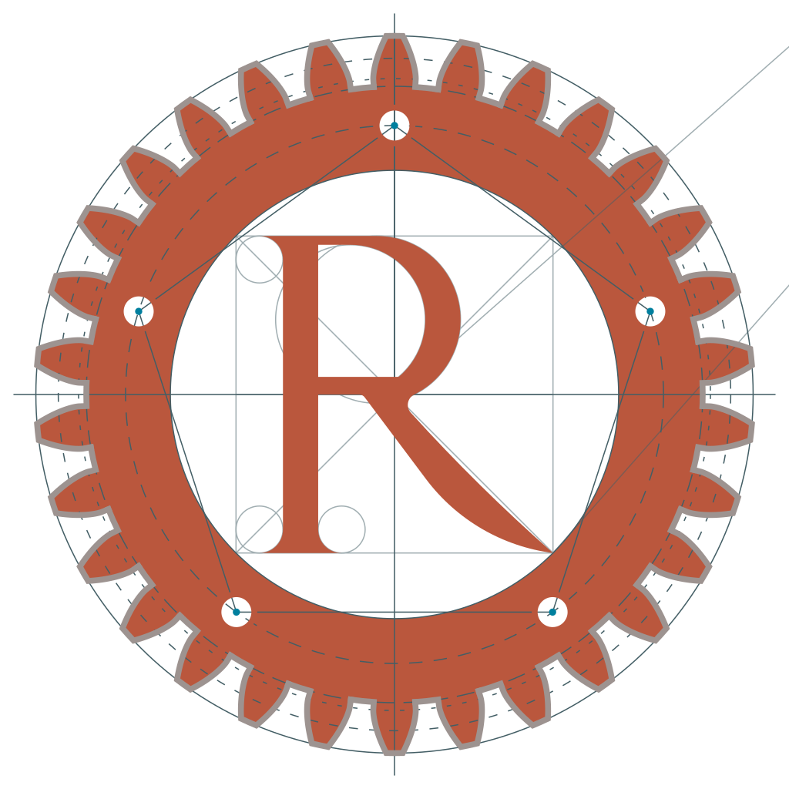

# 🚀 Start Here

Rings Network is a purely peer-to-peer network implementation. We use WebRTC to establish peer connections, and use WebAssembly to allow nodes to run in the browser. Rings Network uses the DHT (Chord) algorithm for message routing/addressing.

By introducing decentralized PKI (public key infrastructure) such as Ethereum and Bitcoin, we have built a series of cryptographic-based network infrastructures. For example, we support end-to-end and hop-by-hop encryption systems, service discovery and registration systems based on resource hashes, and so on.

## Getting Start

Rings Network is being developed using the Rust programming language. The code can be compiled into either WASM or Native format, depending on the specific requirements of different scenarios. For a better understanding of Rings Network, we suggest starting with a Native Node.

#### Start with Native Node

Before starting, make sure you have Rust installed. Follow the [official instructions](https://www.rust-lang.org/tools/install) to install Rust.

[install-a-native-node.md](install-a-native-node.md)

#### Start with a WASM Node

[build-for-wasm.md](build-for-wasm.md)

## Architecture

The Rings Network architecture is streamlined into five distinct layers.

 For more details, please check [architecture.md](advanced-topic/architecture.md)

